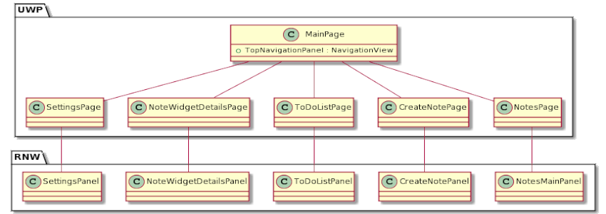
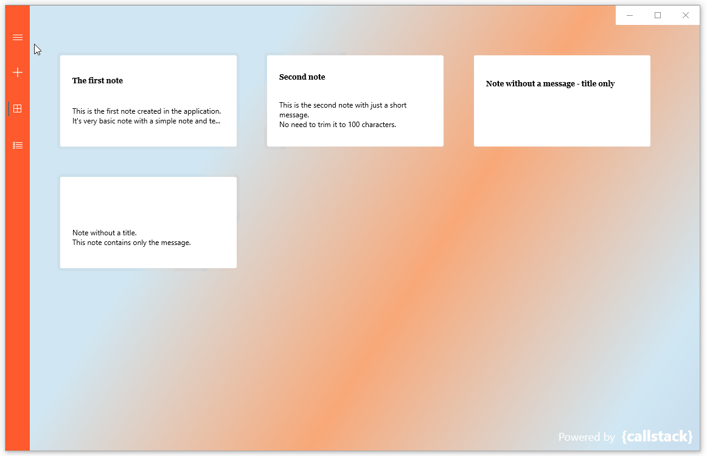

<p align="center">
  
  <h1 align="center"> ReactNativeNotes </h1>
</p>
<p align="center">
    Demo application to create and keep your notes and tasks.
</p>

This project is a demonstration application that presents abilites and skills of [Callstack](https://callstack.com) company in creating React Native Windows **desktop** applications.

The idea behind creating the ReactNativeNotes app was to include features of Windows and React Native Windows [APIs](https://docs.microsoft.com/en-us/windows/uwp/cpp-and-winrt-apis/consume-apis) and to mix both React Native and UWP development.
So beside standard React Native components there is a whole UWP layer which handles all the navigation, animations, and content of a Windows desktop app.
Please check the [Approach](#Approach) section for more details.

**NOTE:** This is the demo application. Its topic is to create and keep your notes and tasks but its purpose is to demonstrate the abilities of React Native Windows. There's no database used for this application, which means that once you close the app, all notes created in this session will be lost.


---
  
## Installation & Usage ##

To play with this app
* Make sure to meet all the [System requirements](https://microsoft.github.io/react-native-windows/docs/rnw-dependencies) for React Native Windows development
* Clone the repository
* Launch the terminal and start the app by the following command:
```
npx react-native run-windows --arch x64
```
(or add `--release --no-launch` to the command line to use the Release version)
This will start all the required tools and launch your app
* alternatively you can launch your app through the Visual Studio by opening the solution file in *\<repo root>/windows/ReactNativeNotes.sln* and launching the Debug configuration.


---

## Approach ##

There are two main layers of the application:
|UWP (C++/WinRT)|RNW (TypeScript)|
|-|-|
|Contains all the XAML Pages of the application.<br>Those Pages can be navigated between using the [`NavigationView`](https://docs.microsoft.com/en-us/uwp/api/windows.ui.xaml.controls.navigationview?view=winrt-20348).<br>Each Page can host exactly one separate `Component` implemented on the React Native side.|Contains all screens (called Panels) of the application<br>Each screen is a separate root for further navigation and widgets<br>These components act as a View for the application.|




So comparing to original React Native Windows where whole application starts from an `index.js` and `App.js`, this solution makes the UWP being a multipile roots hosting not an `index.js`, but many `Components`.


---

## Results ##

The application contains two main screens:
* Notes screen - where all the notes are available for all the Create/Read/Update/Delete operations:


* Tasks screen - where all the tasks are available with calendar date picker for specifying the deadline of a task.


