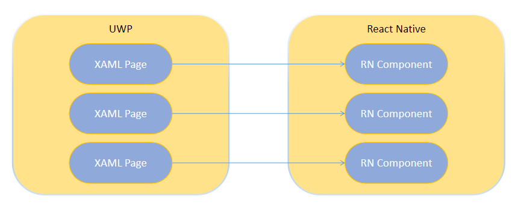
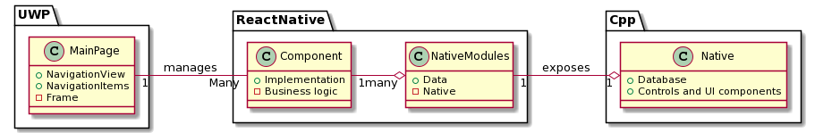

<h1 align="center"> ReactNativeNotes </h1>
<p align="center">
    Demo application to create and keep your notes and tasks.
</p>

This project is a demonstration application that should present the abilites and skills of [Callstack.io](https://callstack.com) company in creating React Native Windows **desktop** applications.

The idea behind creating the Notes app was to include some features of Windows and React Native Windows [APIs](https://docs.microsoft.com/en-us/windows/uwp/cpp-and-winrt-apis/consume-apis) but also to create the application that will contain all the most common usage scenarios of an example desktop application.

The development of this application was also a perfect opportunity to mix both React Native (JavaScript) development with the native UWP (C++) features.
It means that beside standard React Native components there is a whole UWP layer which handles all the navigation, animations, and content of a Windows desktop app.
Please check the [Approach](#Approach) section for more details.


---
  
## Installation & Usage ##

To play with this app
* Make sure to meet all the [System requirements](https://microsoft.github.io/react-native-windows/docs/rnw-dependencies) for React Native Windows development
* Clone the repository
* Launch the terminal and start the app by the following command:
```
npx react-native run-windows --arch x64
```
(or add `--release --no-launch` to the command line to use the Release version)
This will start all the required tools and launch your app
* alternatively you can launch your app through the Visual Studio by opening the solution file in *\<repo root>/windows/ReactNativeNotes.sln* and launching the Debug configuration.


---

## Approach ##

The following application is the combination of skills and features of React Native and UWP development.

There are two main layers of the application:


The first is the UWP layer contains all the XAML Pages of the application.
Those Pages can be navigated between using the [`NavigationView`](https://docs.microsoft.com/en-us/uwp/api/windows.ui.xaml.controls.navigationview?view=winrt-20348).

Each Page can host exactly one separate `Component` implemented on the React Native side.
These components acts as a View for the application.

So in more details, the architecture looks like:


So comparing to original React Native Windows where whole application starts from an `index.js` and `App.js`, this solution makes the UWP being a root hosting not an `index.js`, but many `Components`.


---

## Results ##


---
